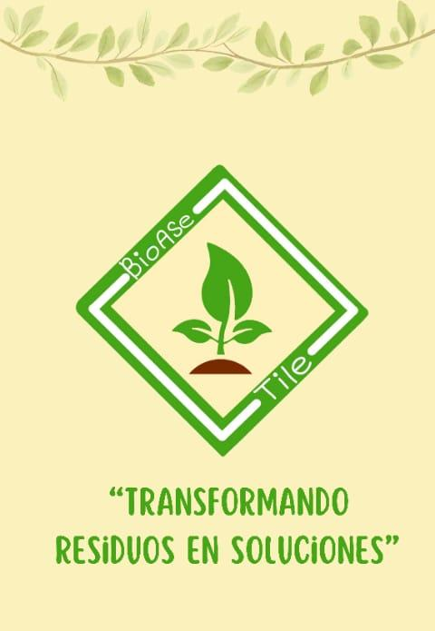

<div align="center">



# BioAse Tile

### *Transformando residuos en soluciones*

Losetas ecológicas fabricadas con aserrín, pulpa de papel reciclado y bioplástico natural.
Una alternativa sustentable hecha en Nuevo Progreso, Tamaulipas.

[**🌐 Visitar sitio web →**](https://bioasetile.github.io/bioase-tile/)


</div>

---

## 🌱 Sobre el proyecto

BioAse Tile es un emprendimiento estudiantil enfocado en el desarrollo de losetas decorativas ecológicas a partir de residuos orgánicos. Nace como respuesta a dos problemas: el alto impacto ambiental de los materiales de construcción tradicionales, y la acumulación de residuos orgánicos que no son aprovechados.

Cada loseta combina:

- **Aserrín** — subproducto de carpinterías locales
- **Pulpa de papel reciclado** — para estructura interna
- **Fibras de cáscara de fruta** — refuerzo natural
- **Bioplástico de fécula de maíz y baba de nopal** — ligante natural
- **Cera de abeja y aceite vegetal** — sellado e impermeabilización

Cero plástico convencional. Cero químicos sintéticos.

## 🏫 Contexto académico

Proyecto desarrollado para la materia **Emprendimiento e Innovación**.

- **Institución:** CONALEP
- **Grupo:** 612 · 6.º semestre
- **Ubicación:** Nuevo Progreso, Tamaulipas, México

## 🛠️ Stack técnico

Sitio web hecho con tecnologías web nativas, sin dependencias pesadas:

- HTML5 semántico
- CSS3 (Grid, Flexbox, custom properties, animaciones)
- JavaScript vanilla (sin frameworks)
- [QRCode.js](https://github.com/davidshimjs/qrcodejs) para el generador de códigos QR
- Tipografías: [Fraunces](https://fonts.google.com/specimen/Fraunces) y [DM Sans](https://fonts.google.com/specimen/DM+Sans) (Google Fonts)

Diseño 100% responsivo, optimizado para dispositivos móviles y desktop.

## 📁 Estructura del proyecto

```
bioase-tile/
├── index.html              # Página principal
├── logo.jpg                # Logo de la marca
├── ubicacion.jpg           # Mapa de ubicación
├── producto-final.jpg      # Foto del producto terminado
├── proceso-aserrin.jpg     # Foto: aserrín tratado
├── proceso-bioplastico.jpg # Foto: cocción del bioplástico
├── proceso-mezcla.jpg      # Foto: mezcla del biocompuesto
├── proceso-nopal.jpg       # Foto: baba de nopal
├── proceso-tratamiento.jpg # Foto: tratamiento manual
├── proceso-vertido.jpg     # Foto: vertido sobre aserrín
├── README.md               # Este archivo
└── LICENSE                 # Licencia MIT
```

## 🚀 Cómo correrlo localmente

No requiere instalación ni build. Simplemente:

```bash
git clone https://github.com/BioAseTile/bioase-tile.git
cd bioase-tile
```

Y abre `index.html` en cualquier navegador moderno.

## 📬 Contacto

- 📧 **Correo:** bioase.tile@gmail.com
- 📍 **Ubicación:** Av. Las Flores s/n, Nuevo Progreso, Tamaulipas

---

<div align="center">

**Hecho con 🌿 por el equipo BioAse Tile**

*"Cada kilo de aserrín que llega al basurero es una promesa rota de la naturaleza."*

</div>
